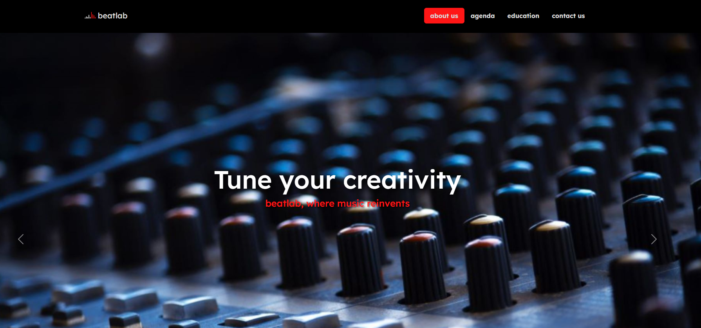

<h1 align="center"> beatlab </h1>

"Sintonize sua criatividade. BeatLab, o lugar onde a música se reinventa."

  <a href="#-tecnologias">Tecnologias</a>&nbsp;&nbsp;&nbsp;|&nbsp;&nbsp;&nbsp;
  <a href="#-projeto">Projeto</a>&nbsp;&nbsp;&nbsp;|&nbsp;&nbsp;&nbsp;
  <a href="#-layout">Layout</a>&nbsp;&nbsp;&nbsp;|&nbsp;&nbsp;&nbsp;
  <a href="#-prompt">Prompts</a>&nbsp;&nbsp;&nbsp;|&nbsp;&nbsp;&nbsp;  

 

  

## 🚀 Tecnologias

Esse projeto foi desenvolvido com as seguintes tecnologias:

- HTML, CSS, Bootstrap
- Git e Github
- Figma
- ChatGPT

## 💻 Projeto

🎵 Imagine um lugar onde cada nota é uma paleta de cores, onde a batida do coração encontra a melodia da alma. Bem-vindo ao BeatLab, onde a música transcende os limites e se torna uma experiência que pulsa com vida e emoção. 🌟

No BeatLab, não estamos apenas construindo músicas; estamos moldando universos sonoros. É aqui que a inspiração encontra inovação, e cada espaço é mais do que uma sala - é um portal para a criação mágica.

#### ✨ Explore Seu Próprio Ritmo:
Seja você um produtor em ascensão, um compositor visionário ou um amante da música, o BeatLab é a plataforma para explorar e expressar sua musicalidade única. Afinal, a música não é apenas o que fazemos, é quem somos.

#### ✨ Comunidade Harmoniosa:
O BeatLab é mais do que um estúdio; é uma comunidade de mentes musicais apaixonadas. Colabore, compartilhe, e encontre inspiração em uma sinfonia de talento que ressoa em cada canto deste santuário musical.

#### ✨ Educação Elevada:
Nossos cursos não são apenas aulas; são viagens musicais. Da teoria à prática, mergulhe em cursos que expandem horizontes, desbloqueiam criatividade e transformam aspirações musicais em realizações épicas.

Somos Seu Palco, Seu Estúdio, Sua Inspiração:
No BeatLab, as paredes ecoam com as histórias que as músicas contam. Cada batida é uma página em branco esperando sua história ser escrita. Seja parte desta sinfonia de possibilidades, onde as notas dançam e a criatividade é a única regra.

Bem-Vindo à Casa da Música, Bem-Vindo ao BeatLab - Onde Seu Som Ganha Vida! 🚀🎶

- [Visite o projeto online]()

## 🔖 Layout

Você pode visualizar o layout do projeto através [DESSE LINK](https://www.figma.com/community/file/1324520151382202433/beatlab). É necessário ter a conta do [Figma](https://figma.com) para acessá-lo.

## 🧠 Prompts

ChatGPT：

#### ✨ Ação: Nome do Studio  
#### 🧠 Prompt:
> Você é um publicitário especialista em marketing e vamos criar um estúdio de música e eu gostaria de uma ajuda para criar 5 sugestões de nomes criativos para esse estúdio.  
{REGRAS}  
>  - O nome deve ser enxuto  
>  - O nome deve ter alguma palavra forte que remeta música
 
 

#### ✨ Ação: Criação de frases de impacto para o site  
#### 🧠 Prompt  

>BeatLab é um estúdio de música que oferece diversos serviços. Além de alugar o seu espaço ele também disponibiliza music makers, compositores, produtores para músicos iniciantes ou não. Também tem uma área de educação sobre música e produção musical. Crie para mim 5 exemplos de frazes impactantes para colocar em um banner no site do estúdio BeatLab 
 {REGRAS}
> - A frase deve ser curta
> - A frase deve ser inspiradora
> - Use a frase: "Crie músicas em boa companhia" como exemplo para frases similares ou com significados próximos
> - Quero que o slogan seja algo parecido com o Spotify 
 
{REGRAS NEGATIVAS} 
> - Não quero que na frase contrenha a lista das palavras e suas variações: alugue, aprenda

